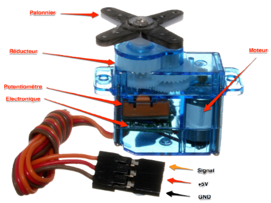
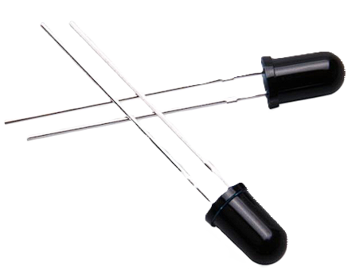

# Phoenix
## À propos du projet

Dans la mythologie, le phénix est un oiseau légendaire qui est capable de renaître de ses cendres après avoir été consumé par le feu. 
Cette capacité de renaissance est souvent interprétée comme un symbole de résilience, de régénération et de lutte contre les éléments destructeurs 
tels que le feu. En raison de cette symbolique, le phénix est parfois utilisé comme emblème dans les domaines liés à la protection contre les incendies et à 
la lutte contre les flammes. D'où le nom du projet **Phoenix**.

## Sommaire
1. Introduction
2. Objectifs du projet 
3. Conception et mécanisme 
4. Detection de flamme et de fumée
5. Système d'extinction
6. Transfert de données vidéos 
7. Sécurité et précaution (comment utiliser le robot / le faire fonctionner)
8. Perspectives d'Amélioration
9. sources et Date de consultation
10. conclusion 

## Introduction

Phoenix est un robot d'extinction de feu d'incendie destiné à accompagner les sapeurs-pompiers et à les aider à être 
plus efficaces dans leurs missions de sauvetage. 
Les incendies sont des catastrophes imprévisibles qui exigent des interventions rapides et éfficaces. C’est là que 
notre minirobot pompier **Phoenix** entre en scène. Intelligent, ce petit héros mécanique est conçu pour assister et 
aider les pompiers dans leurs activités quotidiennes.

## OBJECTIFS DU PROJETS 
Le système doit pouvoir :
* Se déplacer de façon autonome
* Détecter les flammes et la fumée
* Éteindre les flammes
* Éviter les obstacles
* Transmettre une capture vidéo à un téléphone mobile

## CONCEPTION ET MECANISMES

### Etapes du travail

L'équipe a été scindé en trois parties : 
* Une partie s'occupant de la partie électronique
* Une partie qui s'occupe du design et de la modélisation 3D
* Une partie qui s'occupe de la documentation

### Liste du matériel

| **COMPOSANTS**              | **QUANTITE** |
|-----------------------------|:------------:|
| Carte Arduino               |      1       |
| Servomoteurs                |      5       |
| ESP 32 CAM                  |      1       |
| Module de pilote de moteurs |      1       |
| Capteur de flamme           |      1       |
| Capteur de gaz              |      1       |
| Capteurs ultrason           |      1       |
| Capteur de niveau d’eau     |      1       | 
| Pompe à eau                 |      1       |
| Tuyau d’eau                 |      1       |
| Réservoir d’eau             |      1       |

### Réalisation du premier objectif : Déplacement du robot

Pour assurer le déplacement du robot, nous allons utiliser des servos débridés.  
Les étapes pour débrider sont : vérifier si le servomoteur fonctionne correctement, ouvrir le boîtier du servomoteur,
déconnecter le potentiomètre, ajuster la vitesse à 90° et téléverser le code, mettre en marche le servomoteur, ajuster
le potentiomètre pour que le servomoteur ne tourne plus à 90°, et enfin, remonter
le boîtier.  

 

Les servomoteurs ainsi débridés fonctionnent en rotation perpétuelle dans les 2 sens. Donc pour les angles compris 
entre 0° et 89° ils tournent dans le sens horaire, pour les angles compris entre 91° et 180° ils tournent dans le sens 
antihoraire et à 90°, ils s'arrêtent. Nous avons mis plus bas, un extrait du programme qui illustre l'utilisation de ces 
angles.

* Modélisation

Le robot est constitué de deux étages imprimés en PLA :
Le premier étage porte la plus par des éléments électroniques du robot, c'est-à-dire la carte arduino, les 4 servomoteurs
de traction, les capteurs de flamme, le capteur ultrason et la battérie.  

.png)  

Le deuxième étage porte tout le système d'arrosage, c'est-à-dire le réservoir d'eau, la pompe à eau, le tuyau ainsi que 
le servomoteur pour le déplacement du jet d'eau.

.png)

* Programme  

Voici un extrait du programme qui contient toutes les fonctions que nous utilisons pour assurer 
les déplacements du robot.

    #include <Servo.h> // librairie incluse pour la gestion des servos

    // création des différents objets servos
    Servo servo_G1; // servo gauche devant
    Servo servo_G2; // servo gauche derrière
    Servo servo_D1; // servo droit devant
    Servo servo_D2; // servo droit derrière

    void setup() { // liaison des servos aux broches de l'arduino
      servo_G1.attach(3);
      servo_G2.attach(5);
      servo_D1.attach(6);
      servo_D2.attach(9);
    }

    // les fonctions pour effectuer les différents mouvements
    void avancer(){
      // les 4 moteurs tournent vers l'avant
      servo_G1.write(170);
      servo_G2.write(170);
      servo_D1.write(10);
      servo_D2.write(10);
    }
    
    void reculer(){
      // les 4 tournent vers l'arrière
      servo_G1.write(10);
      servo_G2.write(10);
      servo_D1.write(170);
      servo_D2.write(170);
    }
    
    void gauche(){
      // on arrête le moteur avant gauche en laissant tourner les autres
      servo_G1.write(90);
      servo_G2.write(170);
      servo_D1.write(10);
      servo_D2.write(10);
    }
    
    void droite(){
      // on arrête le moteur avant droit en laissant tourner les autres
      servo_G1.write(170);
      servo_G2.write(170);
      servo_D1.write(90);
      servo_D2.write(10);
    }
    
    void arret(){
      // les 4 moteurs tournent vers l'avant
      servo_G1.write(90);
      servo_G2.write(90);
      servo_D1.write(90);
      servo_D2.write(90);
    }

Conformément aux intervals précédemment donnés, dans cet extrait, pour éviter un problème de blocage ou de manque de 
vitesse, nous avons fait tourner chaque moteur à pleine vitesse avec une marge de 10° : on utilise donc 170° et 10° comme
vitesses de rotation. Et à 90°, ils sont à l'arrêt. 

* sources

Pour cette partie, surtout pour débrider les servos, nous avons suivi les conseils et la méthode qui nous a été proposée 
à la formation du samedi 16 mars dans le cadre du boot camp Arduino Day.  
Pour ce qui est du contrôle des servo et du code, nous sommes basé sur une logique exploitée sur la chaine youtube :
**Hobby Project** : https://drive.google.com/drive/u/0/folders/1hj5Dn0m3uD9UZSHQwB2p8elB4GVzE0zX

     
* Electronique 

Voici le premier montage concernant les moteurs :

  
### Détection de fumée et de flamme

Pour assurer la detection des flammes, nous utilisons 3 capteurs de flamme standards placés à l'avant du dispositif :
l'un au milieu, un autre à sa gauche et le dernier à droite.

Contrairement à la plupart des capteurs de flammes comme le KY-026 équipés d'une plaquette électronique portant 
un potentiomètre permettant de régler la sensibilité, ceux-ci sont uniquement constitués de phototransistors.
Cependant, nous n'avons pas encore trouvé le datasheet pouvant nous donner des précisions sur sa précision. 

* Programme   

Voici l'extrait du programme qui concerne les capteurs de flamme.

      /* les broches des capteurs de flamme sont connectées ainsi :
      le capteur du milieu est connecté à la broche A0, celui de gauche à A1 
      et celui de droite à A2
      */
      
      
      int c_milieu; 
      int c_gauche; 
      int c_droit; 

      void loop(){
        c_milieu = digitalRead(A0);// valeur lue au niveau du capteur du milieu
        c_gauche = digitalRead(A1);// valeur lue au niveau du capteur de gauche
        c_droit = digitalRead(A2); // valeur lue au niveau du capteur de droite
      
        if (c_milieu == 0 && c_gauche == 0 && c_droit == 0){
          arret();
        }
        else if (c_milieu > 0){
          avancer();
        }
        else if (c_gauche < 0){
          gauche();
        }
        else if (c_droit > 0){
          droite();
        }
      
        delay(2000);
      
        while(c_milieu > 0){
          arrosage();
        }
        
      }

**Explication de l'extrait**  

Selon **Arduino_En_pratique_Avec_10_Leçons**, le phototransistor fonctionne comme un transistor standard, mais au lieu 
d'être activé et désactivé avec une tension de polarisation typique et une source de courant à sa borne de base, 
la base est régulée par l'intensité de la lumière IR émise par les flammes. Ainsi, plus l'intensité de la flamme est élevée, 
plus le courant d'émetteur est élevée et donc la tension aux bornes de la résistance pull down augmente. C'est cette tension
que nous mesurons.  
Chacune des mesures c_milieu, c_gauche et c_droit correspond à la tension présente aux bornes de la résistance pull down 
correspondante respectivement aux capteurs placés au milieu, à gauche et à droite. Ainsi, si l'une de ces valeurs est 
supérieure à zéro, une flamme est alors détectée : le dispositif se déplace donc dans en direction de la flamme.

* Sources  

Pour utiliser ce capteur, nous nous sommes inspiré du cours dans le document : **Arduino_En_pratique_Avec_10_Leçons**
De _Khalid LAFKIH_
[Arduino_En_pratique_Avec_10_Leçons.pdf](sources/Arduino_En_pratique_Avec_10_Lecons.pdf)
     

  
* Electronique  

### Système d'extinction

 * Mécanisme 

     pour éteindre les flammes le robot se sert de l'eau qui sortira d'un tuyeau en la
dispersant sur la surface en feu 

Voici le tuyau d'eau utilisé 

Voici le reservoir d'eau utilisé ici 
     

  
 * Programme de cette partie
   
 * Electronique

Dans cette partie, nous présentons la façon dont le montage a été fait 

   
### Test des trois premiers objectifs 

 * premier test 
avec ce premier test nous avons vérifier si le capteur de gaz fonctionne 
et si le système d'extinction fonctionne 

 video 

### Transfert de données video

### Sécurité et Précaution (comment utiliser le robot \ le faire fonctionner)

* Mode d'utilisation
  
* Comment le faire fonctionner 

### Perspectives d'Amélioration

* Le robot **Phoenix** pourrait être amélioré en pouvant pénétrer dans des environnements à haut risque tels que les 
tunnels, les parkings souterrains, les sites industriels et les raffineries. Équipé d’un jet d’eau diffusant, il peut 
se protéger de la chaleur intense. Doté d’un porte-brancard, le **Phoenix** pourrait assister les pompiers en facilitant 
l’évacuation des blessés. Dans des conditions de visibilité réduite, il deviendra leur précieux allié. Le plateau 
technique de **Phoenix** peut être amélioré de façon à accueillir une cage à outils ou des sangles, permettant le 
* transport de matériel lourd sur le terrain.

* Des Performances Impressionnantes comme la 
Vitesse : Jusqu’à plus de 12 km/h.
Autonomie : plus de 22 km.
Traction : 300 m de tuyau d’eau.
Charge Utile : 800 kg.

* Le robot **Phoenix** pour avoir une modification au niveau du matériel avec lequel on 
a imprimé la carrosserie utilise du métal à la place du PLA. Avoir une apparence beaucoup 
plus esthétique.

### Sources et date de consultation

### Conclusion 

