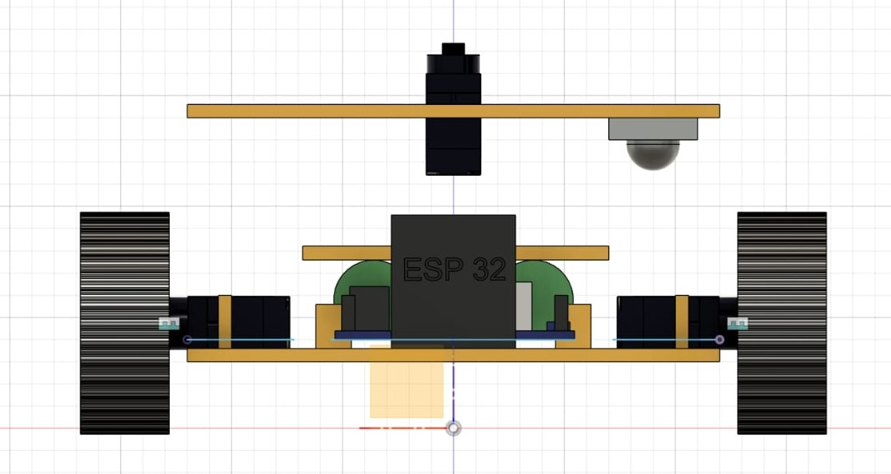

# Phoenix

## À propos du projet

Dans la mythologie, le phénix est un oiseau légendaire qui est capable de renaître de ses cendres après avoir été consumé par le feu. 
Cette capacité de renaissance est souvent interprétée comme un symbole de résilience, de régénération et de lutte contre les éléments destructeurs 
tels que le feu. En raison de cette symbolique, le phénix est parfois utilisé comme emblème dans les domaines liés à la protection contre les incendies et à 
la lutte contre les flammes. D'où le nom du projet **Phoenix**.

### Remerciements

Nous souhaitons exprimer notre profonde gratitude envers toutes les personnes qui ont contribué au succès de notre projet **Phoenix**. En particulier, nous remercions chaleureusement notre encadreur, M. Justin HANKEM, pour ses précieux conseils et son suivi attentif. Nos collaborateurs, ainsi que les experts M. Sylvestre OLANLO qui est le PCA de **TIDD** qui organise **arduino days** au sein du **lycée international Cours lumière** ; M. Giovanni KAMEKPO qui est le président de **TIDD** au Togo ; M. Josaphat BANKAÏ qui est le responsable du fablab **TIDD** qui ont partagé leur savoir-faire et leurs connaissances avec nous, méritent également nos remerciements. Enfin, nous sommes reconnaissants envers nos responsables administratifs qui ont constamment soutenu et accompagné notre réussite.

## Sommaire
1. Introduction et objectifs du projet 
2. Analyse fonctionnelle  
3. Analyse technique
4. Evolution du projet
5. Conclusion

## 1. Introduction et objectifs du projet

Phoenix est un robot d'extinction de feu d'incendie destiné à accompagner les sapeurs-pompiers et à les aider à être 
plus efficaces dans leurs missions de sauvetage. 
Les incendies sont des catastrophes imprévisibles qui exigent des interventions rapides et éfficaces. C’est là que 
notre mini robot pompier **Phoenix** entre en scène. Intelligent, ce petit héros mécanique est conçu pour assister et 
aider les pompiers dans leurs activités quotidiennes.

**OBJECTIFS DU PROJETS**  

Le système doit pouvoir :
* Se déplacer de façon autonome
* Détecter les flammes et la fumée
* Éteindre les flammes
* Éviter les obstacles
* Transmettre une capture vidéo à un téléphone mobile

## 2. Analyse fonctionnelle
| Fonctions | Rôle                                                           | Critères               | Niveau d'exigence                                                    |
|-----------|----------------------------------------------------------------|------------------------|----------------------------------------------------------------------|
| FP1       | Doit pouvoir détecter les flammes et la fumée                  | Détection de flamme    | A 0.5 m                                                              |
| FP2       | Doit pouvoir éteindre les flammes                              | Emission d'eau         | A 10cm                                                               |
| FP3       | Doit pouvoir se déplacer de façon autonome                     | Vitesse et adhérence   |                                                                      |
| FP4       | Doit pouvoir éviter les obstacles                              | Déplacement            | Eviter les obstacles situés à une distance située entre 2cm et 400cm |
| FP5       | Doit pouvoir envoyer une capture vidéo                         | Transmission d'image   | On doit pouvoir voir l'état de la piéce                              |
|           |                                                                |                        |                                                                      |
| FS1       | Doit pouvoir résister aux températures élevées                 | Carrosserie résistante | Jusqu'à 60°C                                                         |
| FS2       | Doit pouvoir émettre un son à la détection de fumée            | Emission  de son       | ___                                                                  |
| FS3       | Doit pouvoir émettre de la lumière à la détection d'une flamme | Emission  de lumière   | ___                                                                  |   

## 3. Analyse technique

### 3.1. Liste du matériel utilisé

| **COMPOSANTS**          | **QUANTITE** |
|-------------------------|:------------:|
| Carte Arduino           |      1       |
| Servomoteurs            |      5       |
| ESP 32 CAM              |      1       |
| Buzzer                  |      1       |
| Capteur de flamme       |      1       |
| Capteur de gaz          |      1       |
| Capteurs ultrason       |      1       |
| Capteur de niveau d’eau |      1       | 
| Pompe à eau             |      1       |
| Tuyau d’eau             |      1       |
| Réservoir d’eau         |      1       |

### 3.2. Analyse mécanique 

* Le dispositif dispose de deux étages imprimés en PLA.  
Le premier étage portant la plus par des éléments électroniques du robot, c'est-à-dire la carte arduino, les 4 servomoteurs
de traction, les capteurs de flamme, le capteur ultrason et la battérie, tandis que le deuxième étage porte tout le 
système d'arrosage, c'est-à-dire le réservoir d'eau, la pompe à eau, le tuyau ainsi que 
le servomoteur pour le déplacement du jet d'eau.  

* Pour assurer le déplacement du robot, nous allons utiliser des servos débridés.  

    

Les étapes pour débrider sont : vérifier si le servomoteur fonctionne correctement, ouvrir le boîtier du servomoteur,
déconnecter le potentiomètre, ajuster la vitesse à 90° et téléverser le code, mettre en marche le servomoteur, ajuster
le potentiomètre pour que le servomoteur ne tourne plus à 90°, et enfin, remonter
le boîtier.  

Les servomoteurs ainsi débridés fonctionnent en rotation perpétuelle dans les 2 sens. Donc pour les angles compris 
entre 0° et 89° ils tournent dans le sens horaire, pour les angles compris entre 91° et 180° ils tournent dans le sens 
antihoraire et à 90°, ils s'arrêtent. Nous avons mis plus bas, un extrait du programme qui illustre l'utilisation de ces 
angles.

Seul le servo assurant le control du jet d'eau n'est pas débridé.

Voici donc les images du modèle du dispositif réalisé avec fusion 360.

Vue du dessus (1er étage)

Vue de dessus (2ᵉ étage)

Vue frontale :

Vue latérale :

Vue de derrière :

Vue en perspective:

  

### 3.3. Analyse électrique 

* **Montage électrique :** 

* **Programme**

      #include <Servo.h>
      
      /* les broches des capteurs de flamme sont connectées ainsi :
      le capteur du milieu est connecté à la broche A0, celui de gauche à A1 
      et celui de droite à A2
      */
      
      #define c_mq2 A3 //broche du capteur de gaz
      #define pompe 12 //broche de la pompe
      #define buzzer 2 //broche du buzzer
      
      int valeur_gaz;
      
      int c_milieu = 4; 
      int c_gauche = 7; 
      int c_droit = 8; 
      
      int v_milieu; 
      int v_gauche; 
      int v_droit;
      
      Servo servo_G1; // servo gauche devant
      Servo servo_G2; // servo gauche derrière
      Servo servo_D1; // servo droit devant
      Servo servo_D2; // servo droit derrière
      
      Servo servo_pompe; // servo moteur de la pompe
      
      void setup() {
        pinMode(pompe, OUTPUT);
        pinMode(c_mq2, INPUT);
        pinMode(buzzer, OUTPUT);
      
        pinMode(c_milieu, INPUT);
        pinMode(c_gauche, INPUT);
        pinMode(c_droit, INPUT);
      
        servo_G1.attach(3);
        servo_G2.attach(5);
        servo_D1.attach(6);
        servo_D2.attach(9);
        
        servo_pompe.attach(10);
      }
      
      void loop(){
      
        valeur_gaz = analogRead(c_mq2);
      
        v_milieu = digitalRead(c_milieu);// valeur lue au niveau du capteur du milieu
        v_gauche = digitalRead(c_gauche);// valeur lue au niveau du capteur de gauche
        v_droit = digitalRead(c_droit); // valeur lue au niveau du capteur de droite
      
        if (valeur_gaz> 200) { 
          digitalWrite(buzzer, HIGH); 
          }
         else { 
          digitalWrite(buzzer, LOW); 
          }
      
      
        if (v_milieu == 0 && v_gauche == 0 && v_droit == 0){
          arret();
        }
        else if (v_milieu == 1){
          avancer();
        }
        else if (v_gauche == 1){
          gauche();
        }
        else if (v_droit == 1){
          droite();
        }
      
        delay(2000);
      
        while(v_milieu == 1){
          arrosage();
        }
        arret();
        
      }
      
      
      // les fonctions pour effectuer les différents mouvements
      void avancer(){
        // les 4 moteurs tournent vers l'avant
        servo_G1.write(170);
        servo_G2.write(170);
        servo_D1.write(10);
        servo_D2.write(10);
      }
      
      void reculer(){
        // les 4 tournent vers l'arrière
        servo_G1.write(10);
        servo_G2.write(10);
        servo_D1.write(170);
        servo_D2.write(170);
      }
      
      void gauche(){
        // on arrête le moteur avant gauche en laissant tourner les autres
        servo_G1.write(90);
        servo_G2.write(170);
        servo_D1.write(10);
        servo_D2.write(10);
      }
      
      void droite(){
        // on arrête le moteur avant droit en laissant tourner les autres
        servo_G1.write(170);
        servo_G2.write(170);
        servo_D1.write(90);
        servo_D2.write(10);
      }
      
      void arret(){
        // les 4 moteurs tournent vers l'avant
        servo_G1.write(90);
        servo_G2.write(89);
        servo_D1.write(91);
        servo_D2.write(90);
      }
      
      // fontion pour émettre le jet d'eau
      void arrosage(){
      
        digitalWrite(pompe, HIGH); // on allume la pompe
        // le servo fait ensuite un balayage
        for (int pos=50; pos<=130; pos++){
          servo_pompe.write(pos);
          delay(100);
        }
        for (int pos=130; pos>=50; pos--){
          servo_pompe.write(pos);
          delay(100);
        }
        // puis on arrête la pompe
        digitalWrite(pompe, LOW);
      }

* **Diagramme d'activité :** 

* **Simulation**

## 4. Evolution du projet

### 4.1 Etapes du travail

L'équipe a été scindé en trois parties : 
* Une partie s'occupant de la partie électronique
* Une partie qui s'occupe du design et de la modélisation 3D
* Une partie qui s'occupe de la documentation

Premières impressions

.png)

* Programme  

Voici un extrait du premier programme qui contient toutes les fonctions que nous utilisons pour assurer 
les déplacements du robot.

    #include <Servo.h> // librairie incluse pour la gestion des servos

    // création des différents objets servos
    Servo servo_G1; // servo gauche devant
    Servo servo_G2; // servo gauche derrière
    Servo servo_D1; // servo droit devant
    Servo servo_D2; // servo droit derrière

    void setup() { // liaison des servos aux broches de l'arduino
      servo_G1.attach(3);
      servo_G2.attach(5);
      servo_D1.attach(6);
      servo_D2.attach(9);
    }

    // les fonctions pour effectuer les différents mouvements
    void avancer(){
      // les 4 moteurs tournent vers l'avant
      servo_G1.write(170);
      servo_G2.write(170);
      servo_D1.write(10);
      servo_D2.write(10);
    }
    
    void reculer(){
      // les 4 tournent vers l'arrière
      servo_G1.write(10);
      servo_G2.write(10);
      servo_D1.write(170);
      servo_D2.write(170);
    }
    
    void gauche(){
      // on arrête le moteur avant gauche en laissant tourner les autres
      servo_G1.write(90);
      servo_G2.write(170);
      servo_D1.write(10);
      servo_D2.write(10);
    }
    
    void droite(){
      // on arrête le moteur avant droit en laissant tourner les autres
      servo_G1.write(170);
      servo_G2.write(170);
      servo_D1.write(90);
      servo_D2.write(10);
    }
    
    void arret(){
      // les 4 moteurs tournent vers l'avant
      servo_G1.write(90);
      servo_G2.write(90);
      servo_D1.write(90);
      servo_D2.write(90);
    }

Conformément aux intervals précédemment donnés, dans cet extrait, pour éviter un problème de blocage ou de manque de 
vitesse, nous avons fait tourner chaque moteur à pleine vitesse avec une marge de 10° : on utilise donc 170° et 10° comme
vitesses de rotation. Et à 90°, ils sont à l'arrêt. 

* sources

Pour cette partie, surtout pour débrider les servos, nous avons suivi les conseils et la méthode qui nous a été proposée 
à la formation du samedi 16 mars 2024 dans le cadre du boot camp Arduino Day.  
Pour ce qui est du contrôle des servo et du code, nous sommes basé sur une logique exploitée sur la chaine youtube :
**Hobby Project** : https://drive.google.com/drive/u/0/folders/1hj5Dn0m3uD9UZSHQwB2p8elB4GVzE0zX

     
* Electronique 

  
### Détection de fumée et de flamme

Pour assurer la detection des flammes, nous utilisons 3 capteurs de flamme standards placés à l'avant du dispositif :
l'un au milieu, un autre à sa gauche et le dernier à droite.

* Capteur de flamme
  
 
* Capteur de gaz

* Simulation réalisée
https://youtube.com/shorts/fRy8EgmgvQE?feature=share
[test_gaz.mp4](videos/test_gaz.mp4)

* Programme   

Voici l'extrait du programme qui concerne les capteurs de flamme.

      /* les broches des capteurs de flamme sont connectées ainsi :
      le capteur du milieu est connecté à la broche A0, celui de gauche à A1 
      et celui de droite à A2
      */
      
      
      int c_milieu; 
      int c_gauche; 
      int c_droit; 

      void loop(){
        c_milieu = digitalRead(A0);// valeur lue au niveau du capteur du milieu
        c_gauche = digitalRead(A1);// valeur lue au niveau du capteur de gauche
        c_droit = digitalRead(A2); // valeur lue au niveau du capteur de droite
      
        if (c_milieu == 0 && c_gauche == 0 && c_droit == 0){
          arret();
        }
        else if (c_milieu > 0){
          avancer();
        }
        else if (c_gauche < 0){
          gauche();
        }
        else if (c_droit > 0){
          droite();
        }
      
        delay(2000);
      
        while(c_milieu > 0){
          arrosage();
        }
        
      }

**Explication de l'extrait**  

Selon **Arduino_En_pratique_Avec_10_Leçons**, le phototransistor fonctionne comme un transistor standard, mais au lieu 
d'être activé et désactivé avec une tension de polarisation typique et une source de courant à sa borne de base, 
la base est régulée par l'intensité de la lumière IR émise par les flammes. Ainsi, plus l'intensité de la flamme est élevée, 
plus le courant d'émetteur est élevée et donc la tension aux bornes de la résistance pull down augmente. C'est cette tension
que nous mesurons.  
Chacune des mesures c_milieu, c_gauche et c_droit correspond à la tension présente aux bornes de la résistance pull down 
correspondante respectivement aux capteurs placés au milieu, à gauche et à droite. Ainsi, si l'une de ces valeurs est 
supérieure à zéro, une flamme est alors détectée : le dispositif se déplace donc dans en direction de la flamme.

* Sources  

Pour utiliser ce capteur, nous nous sommes inspiré du cours dans le document : **Arduino_En_pratique_Avec_10_Leçons**
De _Khalid LAFKIH_
[Arduino_En_pratique_Avec_10_Leçons.pdf](sources/Arduino_En_pratique_Avec_10_Lecons.pdf), 
il faut noter que ce document, nous l'avons consulté à plusieurs reprises tout au long du projet  
     

  
* Electronique  

### Système d'extinction

 * Mécanisme 

     pour éteindre les flammes le robot se sert de l'eau qui sortira d'un tuyeau en la
dispersant sur la surface en feu 

Voici le tuyau d'eau utilisé 

Voici le reservoir d'eau utilisé ici 
     

image de la pompe utiliser

 * Programme de cette partie
   
 * Electronique
   

Dans cette partie, nous présentons la façon dont le montage a été fait 

   
### Test des trois premiers objectifs 

 * premier test 
Avec ce premier test, nous avons vérifié si le capteur de gaz fonctionne 
et si le système d'extinction fonctionne 

 video 

https://youtube.com/shorts/xhz_ujWvSjM?feature=share

### Transfert de données video

### Sécurité et Précaution (comment utiliser le robot \ le faire fonctionner)

* Mode d'utilisation
  
* Comment le faire fonctionner 

### Perspectives d'Amélioration

* Le robot **Phoenix** pourrait être amélioré en pouvant pénétrer dans des environnements à haut risque tels que les 
tunnels, les parkings souterrains, les sites industriels et les raffineries. Équipé d’un jet d’eau diffusant, il peut 
se protéger de la chaleur intense. Doté d’un porte-brancard, le **Phoenix** pourrait assister les pompiers en facilitant 
l’évacuation des blessés. Dans des conditions de visibilité réduite, il deviendra leur précieux allié. Le plateau 
technique de **Phoenix** peut être amélioré de façon à accueillir une cage à outils ou des sangles, permettant le 
* transport de matériel lourd sur le terrain.
  
* Assistance respiratoire : Il pourrait être équipé d’un système qui fourni de l’oxygène pour aider les victimes à respirer.
  
* Des Performances Impressionnantes comme la 
Vitesse : Jusqu’à plus de 12 km/h.
Autonomie : plus de 22 km.
Traction : 300 m de tuyau d’eau.
Charge Utile : 800 kg.

* Le robot **Phoenix** pour avoir une modification au niveau du matériel avec lequel on 
a imprimé la carrosserie utilise du métal à la place du PLA. Avoir une apparence beaucoup 
plus esthétique.

### Sources et date de consultation

Tout au long de notre projet, nous avons consulté diverses sources. Ces documents ont été examinés en mars 2024. 

 https://drive.google.com/drive/u/0/folders/1hj5Dn0m3uD9UZSHQwB2p8elB4GVzE0zX

**Arduino_En_pratique_Avec_10_Leçons**
De _Khalid LAFKIH_
[Arduino_En_pratique_Avec_10_Leçons.pdf](sources/Arduino_En_pratique_Avec_10_Lecons.pdf)

## 5. Conclusion 

Notre projet de réalisation d’un minirobot pompier, baptisé Phoenix, a été une expérience enrichissante. Malgré les défis rencontrés, nous avons réussi à atteindre certains de nos objectifs. Le robot est capable de se déplacer de manière autonome, de détecter les flammes et la fumée puis les éteindre. Cependant, nous avons dû faire des compromis en raison des contraintes de temps. Malheureusement, les fonctionnalités d’évitement des obstacles et de transmission de captures vidéo vers un téléphone mobile n’ont pas pu être entièrement réalisées. Néanmoins, nous considérons ce projet comme une étape importante dans notre apprentissage et notre compréhension des systèmes robotiques. En somme, bien que tous nos objectifs n’aient pas été atteints, nous sommes fiers du travail accompli et des compétences acquises tout au long de ce projet. Nous espérons que Phoenix continuera d’inspirer d’autres projets futurs dans le domaine de la robotique

