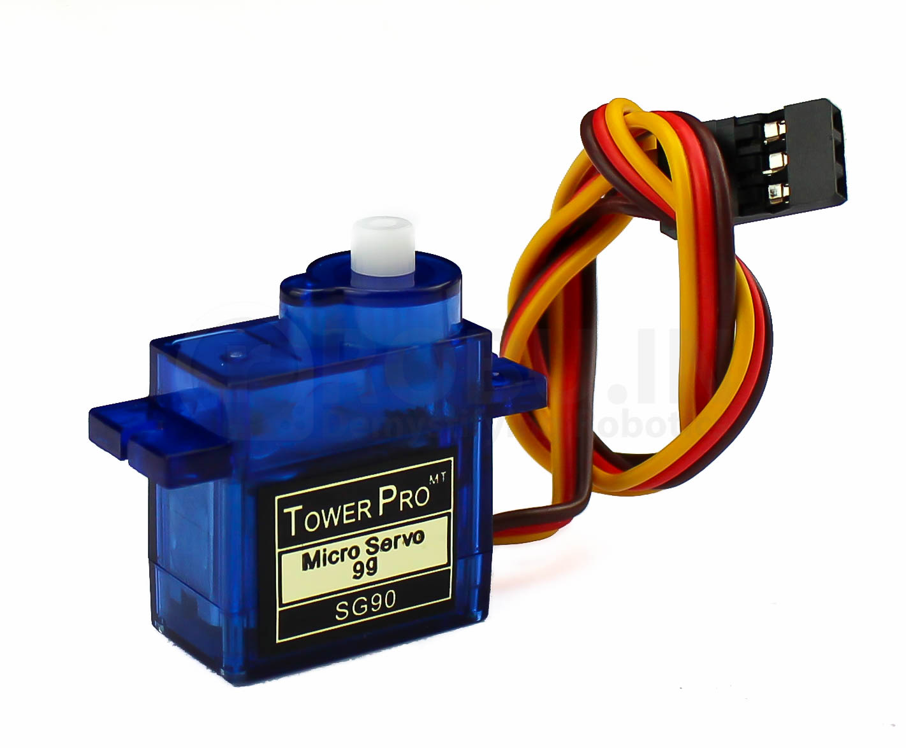

# Phoenix
## À propos du projet

Dans la mythologie, le phénix est un oiseau légendaire qui est capable de renaître de ses cendres après avoir été consumé par le feu. 
Cette capacité de renaissance est souvent interprétée comme un symbole de résilience, de régénération et de lutte contre les éléments destructeurs 
tels que le feu. En raison de cette symbolique, le phénix est parfois utilisé comme emblème dans les domaines liés à la protection contre les incendies et à 
la lutte contre les flammes. D'où le nom du projet **Phoenix**.

## Sommaire
1. Introduction
2. Objectifs du projet 
3. Conception et mécanisme 
4. Detection de flamme et de fumée
5. Système d'extinction
6. Transfert de données vidéos 
7. Sécurité et précaution ( comment utiliser le robot / le faire fonctionner)
8. Perspectives d'Amélioration
9. sources et Date de consultation
10. conclusion 

## Introduction

Phoenix est une robot d'instinction de feu d'incendie destiné à acompagner les sapeurs pompiers et à les aider à être 
plus efficaces dans leurs missions de sauvetage. 
Les incendies sont des catastrophes imprévisibles qui exigent des interventions rapides et éfficaces. C’est là que 
notre mini robot pompier **Phoenix** entre en scène. Intelligent, ce petit héros mécanique est conçu pour assister et 
aider les pompiers dans leur activités quotidiennes.

## OBJECTIFS DU PROJETS 
Le système doit pouvoir :
* Se déplacer de façon autonome
* Détecter les flammes et la fumée
* Éteindre les flammes
* Éviter les obstacles
* Transmettre une capture vidéo à un téléphone mobile

## CONCEPTION ET MECANISMES

### Etapes du travail

L'équipe a été scindé en trois parties : 
* Une partie s'occupant de la partie électronique
* Une partie qui s'occupe du design et de la modélisation 3D
* Une partie qui s'occupe de la documentation

### Liste du matériel

| **COMPOSANTS**              | **QUANTITE** |
|-----------------------------|:------------:|
| Carte Arduino               |      1       |
| Servomoteurs                |      5       |
| ESP 32 CAM                  |      1       |
| Module de pilote de moteurs |      1       |
| Capteur de flamme           |      1       |
| Capteur de gaz              |      1       |
| Capteurs ultrason           |      1       |
| Capteur de niveau d’eau     |      1       | 
| Pompe à eau                 |      1       |
| Tuyau d’eau                 |      1       |
| Réservoir d’eau             |      1       |

### Réalisation du premier objectif: Déplacement du robot

Pour assurer le déplacement du robot nous allons utiliser des servos débridés.
Les etapes pour débryder sont : vérifier si le servomoteur fonctionne correctement ; ouvrir le servomoteur ;
ajuster la vitesse à 90° et téléverser le code ensuite mettre en marche le servomoteur , ajuster le potentiomètre pourqu'a 90°
le servomoteur ne tourne plus et pour terminer on remonte le boitier  

 

* Modélisation
Le robot est constitué de deux étages imprimés en PLA:  

Le premier étage porte la plus par des éléments électroniques du robot, c'est-à-dire la carte arduino, les 4 servomoteurs
de traction, les capteurs de flamme, le capteur ultrason et la battérie.  

  

Le deuxième étage porte tout le système d'arrosage c'est-à-dire le réservoir d'eau, la pompe à eau, les tuyau ainsi que 
le servomoteur pour pour le déplacement du jet d'eau.

     
   * Programme

   * sources :

       pour cette partie on s'est inspirer , documenter  de plusieurs code déja fait que nous avons trouver en ligne
       voici quelle que liens des videos , modèle dont on s'est servit. 

        

     

     
   * Electronique 
  
### Détection de fumée et de flamme

   * Pour assurer la detection de fumée et de flamme 

       nous avons utilisés le capteurs de gaz 

   
   * Programme

     
   * sources

     
   * Electronique 

### système d'Extinction

 * Mécanisme 

     pour éteindre les flammes le robot se sert de l'eau qui sortira d'un tuyeau en la dispersant sur la surface 
     en feu 

     

  
 * Programme de cette partie
   
 * Electronique

   
### Test des trois premiers objectifs 

### Transfert de données video

### Sécurité et Précaution ( comment utiliser le robot \ le faire fonctionner)

* Mode d'utilisation
  
* Comment le faire fonctionner 

### Perspectives d'Amélioration

* Le robot **Phoenix** pourrait etre améliorer en pouvant pénétrer dans des environnements à haut risque tels que les 
tunnels, les parkings souterrains, les sites industriels et les raffineries. Équipé d’un jet d’eau diffusant, il peut 
se protéger de la chaleur intense.Doté d’un porte-brancard, le  **Phoenix** pourrait  assiste les pompiers en facilitant 
l’évacuation des blessés. Dans des conditions de visibilité réduite, il deviendra leur précieux allié.Le plateau 
technique de  **Phoenix**  peut etre améliorer de façon à  accueillir une cage à outils ou des sangles, permettant le 
* transport de matériel lourd sur le terrain.

* Des Performances Impressionnantes comme la 
Vitesse : Jusqu’à plus de  12 km/h.
Autonomie : plus de 22 km.
Traction : 300 m de tuyau d’eau.
Charge Utile : 800 kg.

* Le robot **Phoenix** pour avoir une modifiaction au niveau du matériel avec lequelle on 
a imprimer la carosorie utilser du métal à la place du PLA . Avoir une apparence beaucoup 
plus esthétique .

### Sources et date de consultation

### Conclusion 

